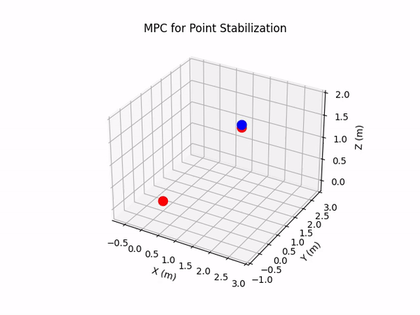
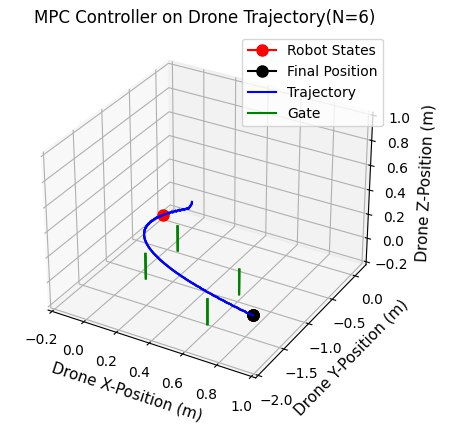
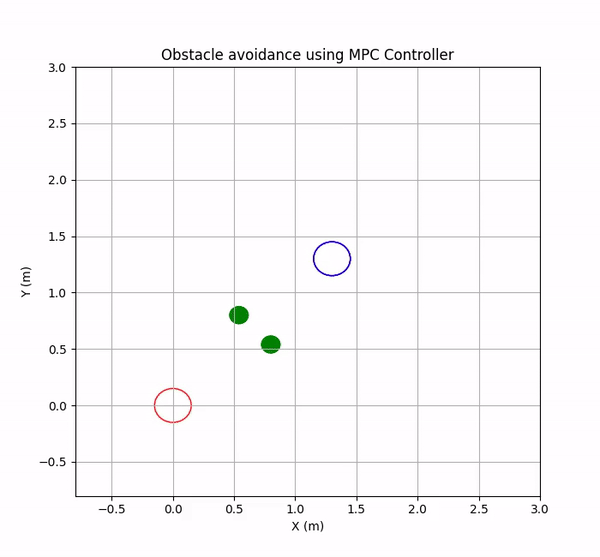

# acm_mpc_drones

# NMPC Drone Control Project

## Overview
In this project, we implement Nonlinear Model Predictive Control (NMPC) to achieve advanced control for quadrotor drones. Unlike traditional Linear MPC, NMPC can handle the nonlinear dynamics of quadrotors, making it a more suitable approach for high-precision and dynamic tasks such as drone racing.

### Why NMPC?

Quadrotors exhibit highly nonlinear behavior, especially when performing aggressive maneuvers or flying in environments with obstacles. NMPC is designed to optimize control actions by solving a nonlinear programming (NLP) problem at each time step, which allows for:

- **Accurate Trajectory Tracking**: Ensuring the quadrotor follows the desired path with high precision.
- **Obstacle Avoidance**: Dynamically adjusting the trajectory to avoid collisions.
- **Rapid Point Stabilization**: Quickly stabilizing the quadrotor at specific points, which is crucial in tasks like passing through gates in drone racing.

### Key Features

- **Nonlinear Dynamics Handling**: Unlike Linear MPC, NMPC can directly incorporate the nonlinear equations of motion of the quadrotor, providing more accurate control.
- **Optimization-Based Control**: Using NLP wtih CasADi, the controller optimizes future control actions over a prediction horizon, considering both the current state and future states of the quadrotor.
- **Flexibility and Robustness**: NMPC can adapt to various flight conditions and disturbances, making it a robust solution for real-world applications.

**Team Members:**
- Roohan Ahmed Khan
- Malaika Zafar
- Amber Batool


**Presentation:** [Final Presentation Link](https://your-presentation-link.com)

## Problem Statement
The primary objective of this project is to develop a control system for fully non-linear quadrotor system that can achieve following tasks:
- Fast point stabilization 
- Follow trajectory to pass through gates precisely
- Avoid obstacles using state constraints
  
Quadrotors are widely used in various applications such as aerial photography, surveillance, delivery services and sports such as drone racing. However, their nonlinear dynamics and the presence of external disturbances make control a challenging task.

### Importance
The project explores the application of MPC for trajectory tracking and obstacle avoidance while passing through gates, highlighting its potential for enhancing performance in this intense sport. The insights gained pave the way for future innovations, offering the potential to revolutionize drone racing with cutting-edge algorithms and strategies. Additionally, addressing the nonlinear dynamics and external disturbances inherent in quadrotor systems is vital for ensuring safe and reliable operation in real-world scenarios. This project emphasizes the importance of MPC in overcoming these challenges, setting the stage for future advancements in drone racing technology.

## Results
The implemented MPC controller successfully stabilizes the drone at the desired point and follows specified trajectories. The results include:
- Response of MPC for single point stabilization
- Stability in orientation and velocity for trajectory tracking.
- Obstacle Avoidance 2D Animation

### Visual Aids
The following plots illustrate the performance of the MPC controller:

1. **MPC Response for point stabilization with terminal cost**
   
   

2. **Trajectory Tracking to pass through gates**
   
   
   
3. **Obstalce Avoidance (2D View)**

   

## Running the Project
Follow these steps to set up and run the project on your local machine.

### Prerequisites
- Python 3.x
- CasADi
- NumPy
- Matplotlib

### Installation
1. Clone the repository:
    ```bash
    git clone https://github.com/R-Ahmed-Khan/acm_mpc_drones.git
    cd acm_mpc_drones
    ```

2. Install the required packages:
    ```bash
    pip install -r requirements.txt
    ```

### Running the Code
1. **Single Point Stabilization:**
    ```bash
    python mpc_drone_single_point.py
    ```

2. **Trajectory Tracking:**
    ```bash
    python mpc_drone_trajectory.py
    ```

3. **Obstacle Avoidance:**
    ```bash
    python mpc_drone_obstacle_avoid.py
    ```

### Tuning of Parameters
In order to tune or change control and system parameters in any python file, access the parameters in each file such as:

#### Control and Dynamical parameters
```bash
...
    T = 0.1                                 # sampling time [s]                        
    N = 6                                   # prediction horizon (Final With Terminal Cost)                        
    M_R = 0.065                             # kg, mass of rotor
    R_R = 0.31                              # m, radius of rotor
    Jr = 1/2 * M_R * R_R**2                 # inertia of rotor about COM
    K1 = K2 = K3 = K4 = K5 = K6 = 0.2       # drag coefficient
    m = 1.1                                 # mass of the quadrotor [kg]
    g = 9.81                                # gravity [m/s^2]
    Ix = 8.1*10**(-3)                       # moment of inertia about Bx axis [kg.m^2]
    Iy =  8.1*10**(-3)                      # moment of inertia about By axis [kg.m^2]
    Iz = 14.2*10**(-3)                      # moment of inertia about Bz axis [kg.m^2]
    l = 0.17                                # quadrotor arm length [m]
    b = 0.5                                 # thrust/lift coefficient [N.s^2]
    d = 0.7                                 # scalling factor
...
```
#### Cost Weights
```bash
...
    Q = np.diag([1.2,1.2,1.2,1.2,1.2,1.2,1,1,1,1,1,1])             # weights for states
    R = np.diag([0.01,0.01,0.01,0.01])                             # weights for inputs
    Q_terminal = np.diag([5, 5, 5, 3, 3, 3, 1, 1, 1, 1, 1, 1])     # weights for terminal states
...
```


## Appendix

### Quadrotor Dynamics

The quadrotor's dynamics are described by the following state-space equations, where the state vector includes positions, orientations, and their respective velocities, and the control inputs are the propeller speeds.

#### States

- Positions in the inertial frame: $$\( x, y, z \)$$ 
- Roll, pitch, and yaw angles: $$\( \phi, \theta, \psi \)$$ 
- Velocities in the inertial frame: $$\( \dot{x}, \dot{y}, \dot{z} \)$$ 
- Angular velocities: $$\( \dot{\phi}, \dot{\theta}, \dot{\psi} \)$$ 

#### Inputs
- : Propeller speeds: $$\( u_1, u_2, u_3, u_4 \)$$

#### Equations of Motion

1. **Position Dynamics:**  
   $$\dot{x} = v_x $$
   $$\dot{y} = v_y $$
   $$\dot{z} = v_z $$


2. **Orientation Dynamics:**
   $$\dot{\phi} = \omega_x $$
   $$\dot{\theta} = \omega_y $$
   $$\dot{\psi} = \omega_z $$

3. **Velocity Dynamics:**

   $$\dot{v_x} = \frac{1}{m}\left(\cos(\phi) \sin(\theta) \cos(\psi) + \sin(\phi) \sin(\psi)\right) f_1 - \frac{K_1 v_x}{m}$$
   $$\dot{v_y} = \frac{1}{m}\left(\cos(\phi) \sin(\theta) \sin(\psi) - \sin(\phi) \cos(\psi)\right) f_1 - \frac{K_2 v_y}{m}$$
   $$\dot{v_z} = -\frac{1}{m}\left(\cos(\psi) \cos(\theta)\right) f_1 + g - \frac{K_3 v_z}{m}$$


4. **Angular Velocity Dynamics:**
   $$\dot{\omega_x} = \frac{I_y - I_z}{I_x} \omega_y \omega_z + \frac{l}{I_x} f_2 - \frac{K_4 l}{I_x} \omega_x + \frac{J_r}{I_x} \omega_y (u_1 - u_2 + u_3 - u_4)$$
   $$\dot{\omega_y} = \frac{I_z - I_x}{I_y} \omega_x \omega_z + \frac{l}{I_y} f_3 - \frac{K_5 l}{I_y} \omega_y + \frac{J_r}{I_y} \omega_z (u_1 - u_2 + u_3 - u_4)$$
   $$\dot{\omega_z} = \frac{I_x - I_y}{I_z} \omega_x \omega_y + \frac{1}{I_z} f_4 - \frac{K_6}{I_z} \omega_z$$

#### Forces and Torques
- Thrust: $$f_1 = b(u_1^2 + u_2^2 + u_3^2 + u_4^2) $$
- Roll Moment: $$f_2 = b(-u_2^2 + u_4^2) $$
- Pitch Moment: $$f_3 = b(u_1^2 - u_3^2) $$
- Yaw Moment: $$f_4 = d(-u_1^2 + u_2^2 - u_3^2 + u_4^2) $$

### State and Input Constraints
#### State Constraints
- Position: $$\infty \leq x,y,z \leq +\infty$$
- Orientation: $$\( -\pi/2 \leq \phi, \theta, \psi \leq \pi/2 \)$$
- Velocities: $$\( -5 \, \text{m/s} \leq v_x, v_y, v_z \leq 5 \, \text{m/s} \)$$
- Angular Velocities: $$\( -0.05 \, \text{rad/s} \leq \omega_x, \omega_y, \omega_z \leq 0.05 \, \text{rad/s} \)$$

#### Input Constraints
- Propeller Speeds: $$\( 0 \leq u_1, u_2, u_3, u_4 \leq 1200 \)$$

### Cost Function 

The cost function is designed to minimize the error between the current state and the desired state while penalizing large control inputs. It consists of a quadratic term for state deviation and another for control effort.

$$Cost = \sum_{i=0}^{N-1} ((x_i - x_s)^T Q (x_i - x_p) + u_i^T R u_i) + (x_N - x_p)^T Q_{terminal} (x_N - x_p)$$
where $$x_p$$ is desired state, $$x_i$$ is current state and $$x_N$$ is terminal state


## Directory Structure
- `mpc_drone_single_point.py`: Script for single point stabilization.
- `mpc_drone_trajectory.py`: Script for trajectory tracking.
- `mpc_drone_obstacle_avoid.py`: Script for obstacle avoidance.
- `resources/draw.py`: Helper functions for plotting results.
- `resources/trajectory.py`: Helper functions for trajectory generation.
- `results/`: Directory containing generated plots for visualization.


